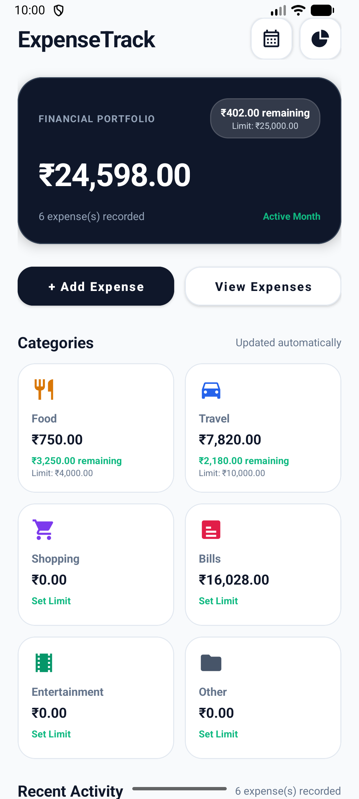
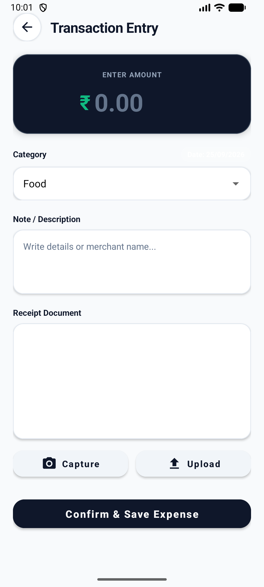
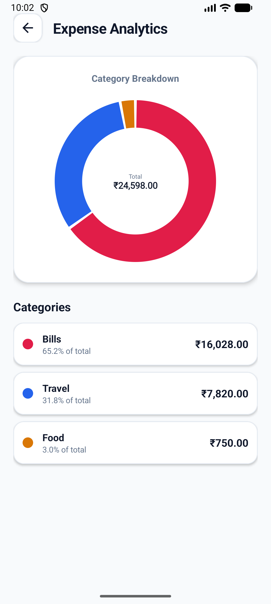
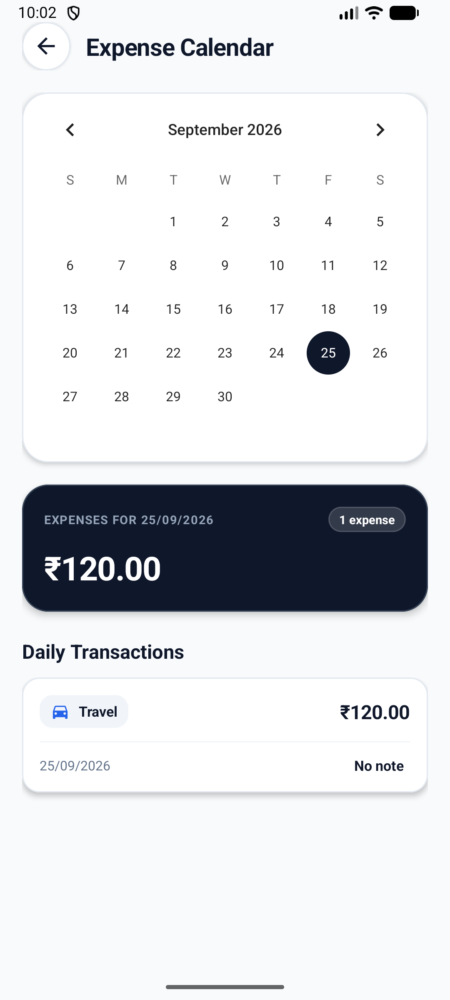
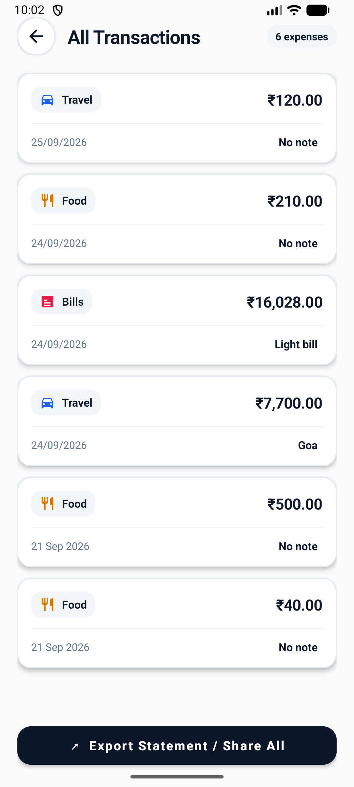
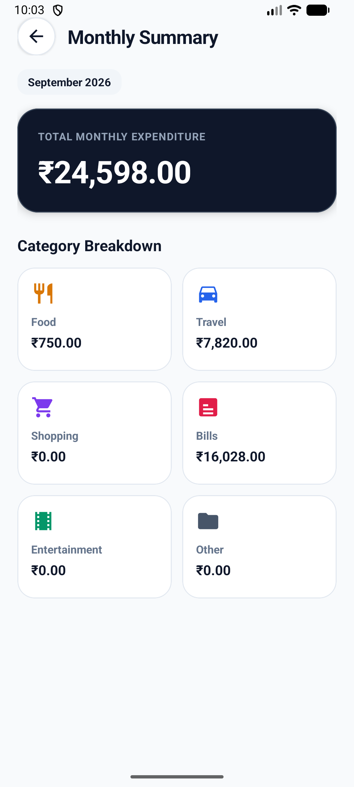

# 💰 ExpenseTrack

> A modern Android expense tracking application built with **Kotlin**, **Room Database**, and **Material 3** that helps users manage daily expenses, store receipts, analyze spending, and generate monthly reports.

---

## 📖 Overview

**ExpenseTrack** is a personal finance management application developed as a **Mobile Application Development (MAD)** project. The app enables users to record daily transactions, capture or upload receipt images, visualize expenses through analytics, browse expenses by calendar date, and export monthly spending summaries.

The application is fully offline and stores all data securely using **Room (SQLite)**.

---

## ✨ Key Features

- 📊 **Smart Dashboard** with live monthly expense overview
- ➕ **Add Expense** with amount, category & notes
- 📷 **Capture Receipt** directly using the device camera
- 📁 **Upload Receipt** from gallery or files
- 🗂 **Room Database** for complete offline storage
- 📅 **Expense Calendar** with automatic date-wise tracking
- 🥧 **Expense Analytics** using Pie Chart visualization
- 📜 **Transaction History** with complete CRUD operations
- 💸 **Budget Limit** with remaining balance indicator
- 📤 **Export & Share** monthly expense statement
- 🔔 Notification & Camera permission support

---

## 🖼️ Screenshots

### Dashboard

|  |  |  |
| :---: | :---: | :---: |
|  |  |  |

|  |  |  |
| :---: | :---: | :---: |
|  |  |  |

---

## 📱 Application Modules

### 🏠 Dashboard
- Displays total monthly expenditure
- Shows remaining budget limit
- Category-wise expense cards
- Quick access to Calendar & Analytics

### 💳 Transaction Entry
- Enter expense amount
- Select expense category
- Add notes or merchant name
- Capture or upload receipt
- Save transaction instantly

### 📅 Expense Calendar
- Automatically saves every expense with today's date
- View expenses for any selected date
- Daily total and transaction count
- Clean calendar navigation

### 📊 Expense Analytics
- Interactive Pie Chart
- Category-wise percentage breakdown
- Highest spending category
- Total monthly expenditure overview

### 📜 Transaction History
- View all recorded expenses
- Date-wise transaction list
- Category and notes display
- Export & Share complete statement

### 📈 Monthly Summary
- Monthly expenditure report
- Category-wise totals
- Budget monitoring
- Ready for sharing or exporting

---

## 🛠️ Technology Stack

| Technology | Purpose |
|------------|---------|
| **Kotlin** | Application development |
| **XML** | User Interface |
| **Room Database** | Local data storage |
| **SQLite** | Offline persistence |
| **ViewBinding** | UI binding |
| **Material 3** | Modern Android design |
| **MPAndroidChart** | Pie chart analytics |
| **Camera & File Picker** | Receipt management |

---

## 📂 Project Structure

```text
ExpenseTrack/
│
├── app/
│   ├── java/
│   │   ├── database/
│   │   ├── model/
│   │   ├── adapter/
│   │   ├── activities/
│   │   └── utils/
│   │
│   └── res/
│       ├── layout/
│       ├── drawable/
│       ├── mipmap/
│       └── values/
│
├── Screenshots/
│   ├── 1.png
│   ├── 2.png
│   ├── 3.png
│   ├── 4.png
│   ├── 5.png
│   └── 6.png
│
└── README.md
```

---


## 📌 Permissions

| Permission | Usage |
|-----------|------|
| Camera | Capture receipt photos |
| Photos / Media | Upload receipt images |
| Notifications | Budget reminders & alerts |

---

## 🎯 Learning Outcomes

This project demonstrates practical implementation of:

- Room Database (SQLite)
- CRUD Operations
- ViewBinding
- Camera Integration
- File Picker
- Calendar-based Data Filtering
- Pie Chart Data Visualization
- Material 3 UI Design
- Android Intents (Share Functionality)

---

## 👤 Project Information

**Name:** Shaurya Patel

**Enrollment No:** 24012011128

**Project Title:** ExpenseTrack

**Subject:** Mobile Application Development (MAD)
